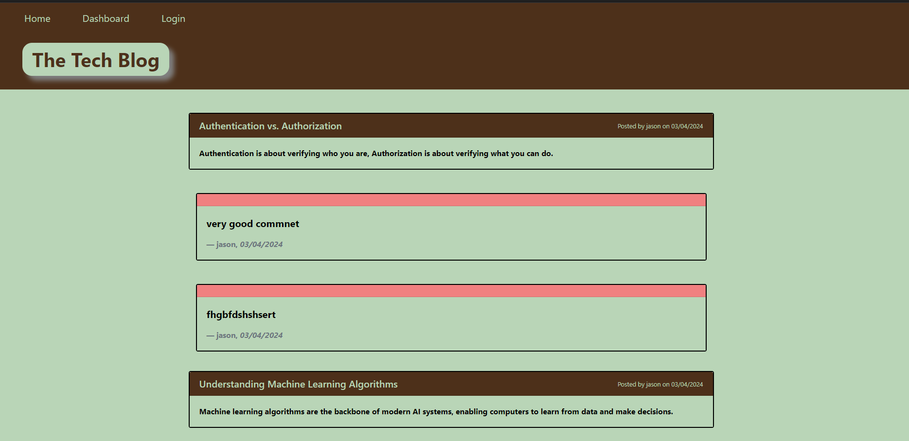

<a id="readme-top"></a>


<div align="center">
  <a href="https://github.com/Jason897571/Raccoon-Tech-Blog">
    
  </a>

  <h3 align="center">Raccoon Tech Blog</h3>

  <p align="center">
    This is Blog for coding developers to discuss new technology or other related topic 
    <br />
    <a href="https://github.com/Jason897571/Raccoon-Tech-Blog"><strong>Click here for Github Repo  »</strong></a>
    <br />
    <br />
    <a href="https://raccoon-tech-blog-7e19826f0a1d.herokuapp.com/">Deployed Demo</a>
    ·
    <a href="https://github.com/Jason897571/Raccoon-Tech-Blog/issues">Report Bug</a>
    ·
    <a href="https://github.com/Jason897571/Raccoon-Tech-Blog/issues">Request Feature</a>
  </p>
</div>

<!-- TABLE OF CONTENTS -->
<details>
  <summary>Navigation of Contents</summary>
  <ol>
    <li>
      <a href="#about-the-project">About The Project</a>
      <ul>
        <li><a href="#built-with">Built With</a></li>
      </ul>
    </li>
    <li>
      <a href="#getting-started">Getting Started</a>
      <ul>
        <li><a href="#prerequisites">Prerequisites</a></li>
        <li><a href="#installation">Installation</a></li>
      </ul>
    </li>
    <li><a href="#usage">Usage</a></li>
    <li><a href="#contact">Contact</a></li>
    <li><a href="#future_additions">Future Additions</a></li>
    <li><a href="#reference">Reference</a></li>
  </ol>
</details>

<a id="#about-the-project"></a>
## About The Project

<p><strong>Start Page</strong></p>




<br />

This is the start page when you download the project. You are allowed to see other's post. However, you need to login to post your own post and leave a comment.


<a id="#built-with"></a>
## Built with
This generator is made with Javascript.

* 

<p align="right">(<a href="#readme-top">back to top</a>)</p>

<a id="getting_started"></a>
## Getting Started

This is an example of how you may give instructions on setting up your project locally.
To get a local copy up and running follow these simple example steps.

<a id="prerequisities"></a>
### Prerequisites

You should have your shell ready for downloading this project. We use gitbash as an example in this project

<a id="installation"></a>
### Installation
1. Get a free API Key at [github](https://github.com/Jason897571/Raccoon-Tech-Blog#built-with)
2. Clone the repo
   ```sh
   git clone https://github.com/Jason897571/Raccoon-Tech-Blog.git
   ```

3. In your terminal, input `npm start` to start the server.


<p align="right">(<a href="#readme-top">back to top</a>)</p>


<a id="usage"></a>
## Usage

When you input `npm start` In your terminal to start the server, you could send request to server to login, logout, create a post, comment on a post, get all posts, update a post or delete a post.


For more details, please refer to the [Documentation](https://github.com/Jason897571/Raccoon-Tech-Blog) 

<p align="right">(<a href="#readme-top">back to top</a>)</p>


<a id="future_additions"></a>
## Future Additions
* set up user center to create user's profiles


<p align="right">(<a href="#readme-top">back to top</a>)</p>


<a id="contact"></a>
## Contact

Jason Gu - [Email](king.gs1314@outlook.com) - king.gs1314@outlook.com

Project Link: [https://github.com/Jason897571/Raccoon-Tech-Blog](https://github.com/Jason897571/Raccoon-Tech-Blog)

<p align="right">(<a href="#readme-top">back to top</a>)</p>

<a id="reference"></a>
## Reference
* Xpert Assistant/ChatGPT
* https://dev.to/envoy_/150-badges-for-github-pnk#games
* https://github.com/othneildrew/Best-README-Template


<p align="right">(<a href="#readme-top">back to top</a>)</p>

<!-- MARKDOWN LINKS & IMAGES -->
<!-- https://www.markdownguide.org/basic-syntax/#reference-style-links -->
[Javascript-url]:https://img.shields.io/badge/JavaScript-F7DF1E?style=for-the-badge&logo=javascript&logoColor=black
